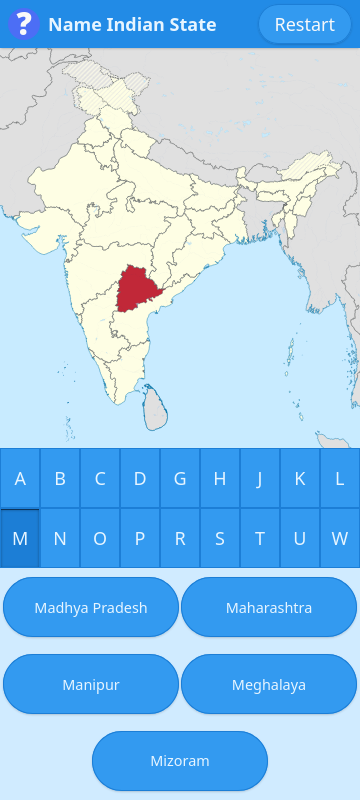

# Name Indian State

A quiz webapp about naming India's states & union territories from shown map.

<https://name-indian-state.pages.dev/>

## Tech Stack

- React
- Typescript
- Vite (& vite-plugin-pwa, vite-plugin-svgr, lightningcss, workbox)
- Wikidata (& SPARQL, wikibase-sdk)
- BiomeJS
- GitHub (& GitHub Actions)
- Cloudflare Pages

## Setup instructions

- Install [PNPM](https://pnpm.io/), [Node.js](https://nodejs.org/), and [Git](https://git-scm.com/).
- Clone the repository & `cd` into it.
- Run `pnpm install` to set up dependencies.
- Run `pnpm run download-maps` to download the latest maps.
- Run `pnpm run dev` to launch a development preview.
- Open the dev server link in your browser
